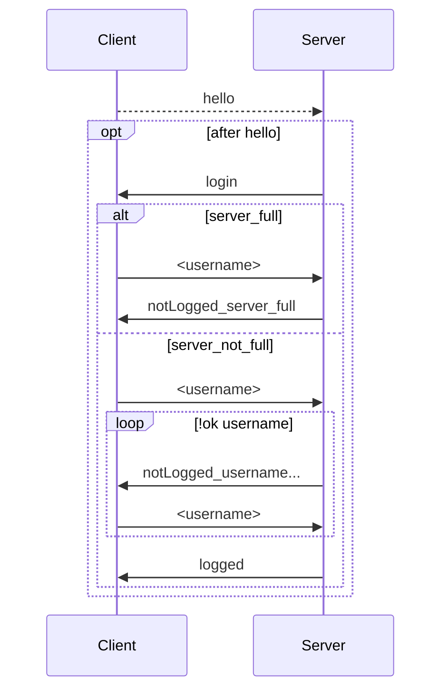
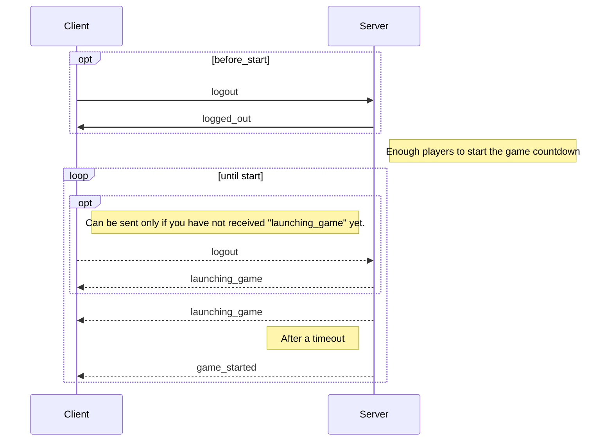

# Standard for Socket communication

A list of strings to define a standard for socket communication in our Sagrada game implementation.

>_**Please Note** : bold words are used to point out parameters, underlined ones indicate formatting oriented keywords._

### Login Handling
* Client ask to server to login

	`hello`
		
* Server requests a username from client
	
	`login`
		
* Client sends chosen username
	
	**`<username>`**
* *Response #1:* Login success

	`logged`

	>**Note**: A successfull login   automatically implies the insertion in the game queue.
	
* *Response #2:* Login failure (ServerFull) 
   
   `notLogged_server_full`
    
* *Response #3:* Login failure (usernameNotAvailable)

    `notLogged_username_not_available`
    

#### Relative sequence diagram

------
### Match Start Handling
* Logout request
`logout`

* Successfully logged out
`logged_out`

* Notify a game will start soon (sent also if you can't log out)
`launching_game`

* Notify a game is started
`game_started`

#### Relative sequence diagram

____

### Match Initialization Handling

* Server sends 1 different Private Objective Card to each player

  `generate_private_obj_card`_`<space>`_**`color`**

* Server sends 2 grids (double-sided ---> 4 technically)
 
   `send_grids_to_user`_`<space>`_**`json_grid`**
   
  >_**Please Note**: json_grid is a basic representation, in json format, of the grid itself._
 
 * Client sends back an integer associated with the chosen grid
 
    `choose_grid`_`<space>`_**`chosen_grid`**
   >_**Please Note**: chosen_grid is an integer with a value between 1 and 4._
    
* Server sends Favor Tokens, according to the difficulty of the chosen grid

   `sends_tokens`_`<space>`_**`tokens`**

* Server sends 3 Public Objective Cards to each client

  `generate_public_obj_cards`_`<space>`_**`json_publ_obj_cards`**
  
  > _**Please Note**: these 3 cards are the same for each client._
  
 * Server sends Tool Cards
 
   `send_tool_cards`_`<space>`_**`json_tool_cards`**

### Match Handling
   
* Server sends a notification when player's turn starts
 
  `turn_notification`_`<space>`_**`its_your_turn`**

* Player requests current dice pool

  `request_dicepool`

* Server sends dice pool 
 
   `send_dicepool`_`<space>`_**`json_dicepool`**
   > _**Please Note**: json_dicepool is a basic representation of dice pool, where every die is selected by value and color._
   
* Player requests current round track
 
  `request_roundtrack`

*  Servers sends round track

   `send_round_track`_`<space>`_**`json_round_track`**

* Client try to insert a die

  `try_to_insert_die`_`<space>`_**`die`**_`<space>`_**`position`**
* Insertion success

  `die_success`
* Insertion failure (action already done)

  `action_already_done`
* Insertion failure (box not available)

  `box_not_available`
* Insertion failure (die not available)

  `die_not_available`
* Insertion failure (play not allowed)

  `play_not_allowed`
* Client try to play a tool card

  `play_tool_card`_`<space>`_**`tool_card_number`**_`<space>`_**`parameters[]`**
  > _**Please Note**: parameters[] represents variable parameters, different for each tool card._

* Play success

  `tool_ok`
* Play failure (not enough tokens)

  `not_enough_tokens`
* Play failure (action already done)

  `action_already_done`
* Play failure (play not allowed)
 
  `play_not_allowed`
 
* Server sends final score

  `send_final_score` _`<space>`_**`score`**
  
  
 *  Player disconnected notification 
 
    `disconnected_notification`_`<space>`_**`player_number`**
* Timer timeout notification

  `timeout`

 
